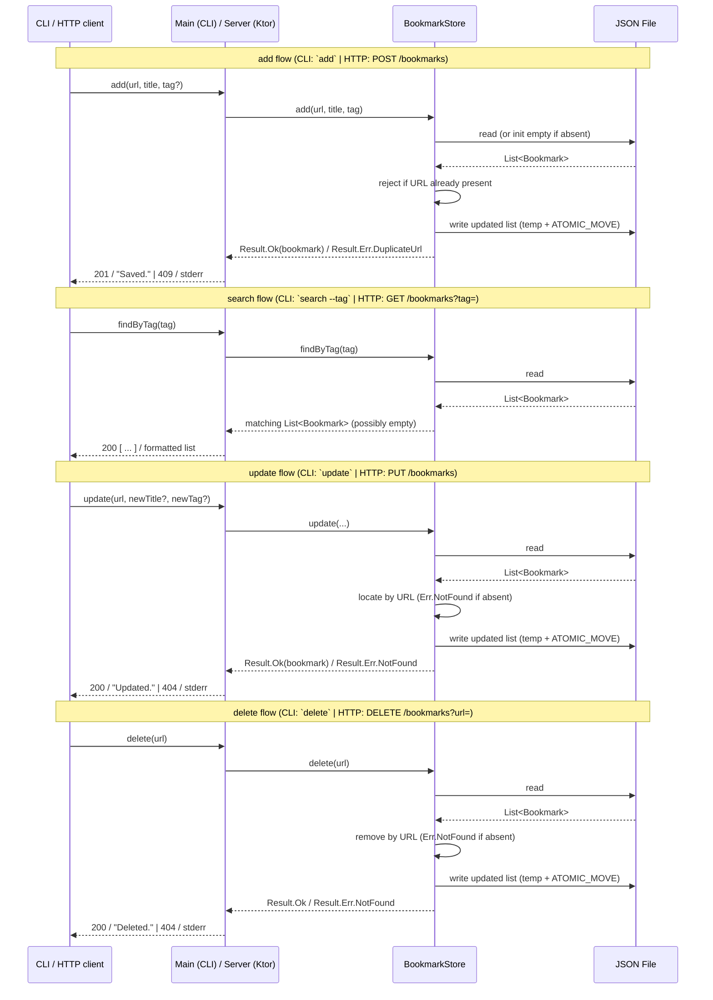

# Implementation Plan: bookmark-manager

> Requirements ref: sdlc/requirements/bookmark-manager.md (status: APPROVED)
> Target repos: `asdlc/kotlin-scaffold`
> Generated: 2026-07-04 (updated: added standing HTTP layer + Postman + Docker + logging spec)

## Tech Stack

- **Language/stack**: Kotlin / JVM (Gradle, Kotlin 2.0.21, JVM toolchain 21)
- **Identified from**: explicit statement in the raw request's technical notes (`draft.md`), confirmed by existing `build.gradle.kts` (`kotlin("jvm")`, `kotlinx-serialization-json`, `application`, `shadow`).

## Scaffold Reference

- **Workspace was empty**: false (at this point). `kotlin-scaffold` was previously copied into this workspace and feature code exists under `src/`.
- **Scaffold name**: `kotlin-scaffold` (see `references/scaffold_registry.md`).
- **Action taken**: none this pass — scaffold already present; this update augments the design, it does not re-copy.

*Note: this skill copies an existing reference scaffold verbatim when one is available; it does not author feature source files. Implementing the HTTP layer described below is the Coding Agent's job (Stage 7), invoked after this document is approved.*

## Component Design

Existing components (CLI + store) are unchanged. This update adds a thin HTTP layer over the same `BookmarkStore` so the service is testable the standard way (Postman/Newman via the `api-tester` gate). No business logic is duplicated — HTTP handlers delegate to `BookmarkStore` exactly as the CLI subcommands do.

**`Bookmark` (data class)** — unchanged.
Fields: `url: String`, `title: String`, `tag: String?`. `@Serializable` via `kotlinx.serialization`. `url` is the natural key; uniqueness is enforced by `BookmarkStore`, not at the type level.

**`BookmarkStore`** — unchanged surface.
Accepts the JSON file path at construction. Path resolution (shared by CLI and HTTP): `--file` CLI flag > `BOOKMARKS_FILE` env var > default `~/.bookmarks.json`. Operations, each returning a sealed `Result` (Ok/Err) — never exceptions for expected error paths:

- `add(url, title, tag?)` — errors `Err.DuplicateUrl` if URL exists; else appends; atomic write (temp `.tmp` + `Files.move(ATOMIC_MOVE)`)
- `list()` — returns all entries
- `findByTag(tag)` — exact-match, case-sensitive; no fuzzy/substring
- `update(url, newTitle?, newTag?)` — errors `Err.NotFound` if URL absent; applies non-null fields; atomic write
- `delete(url)` — errors `Err.NotFound` if URL absent; removes; atomic write

On load: absent file → empty list; unparseable file → `Err` surfacing the file path, never a silent overwrite.

**`Main` (CLI entry point)** — unchanged.

| Subcommand | Flags | Notes |
|---|---|---|
| `add` | `--url`, `--title`, `[--tag]` | Errors on duplicate URL |
| `list` | — | Prints all bookmarks |
| `search` | `--tag` | Exact-match filter |
| `update` | `--url`, `[--title]`, `[--tag]` | At least one of `--title`/`--tag` required |
| `delete` | `--url` | Errors if URL not found |

Global flag `--file <path>` / env `BOOKMARKS_FILE` overrides the default location. Stdout = human-readable success; stderr + non-zero exit = all errors.

**`Server` / HTTP routing (NEW — Ktor)**
A thin Ktor (Netty engine) application exposing the store's operations 1:1, plus the standard health endpoint. Reuses the same `BookmarkStore` and path-resolution logic. A new entry point (e.g. `ServerKt`) starts the server; the existing `MainKt` remains the default CLI entry. JSON (de)serialisation via the `ContentNegotiation` + `kotlinx.serialization` plugin.

Store `Result.Err` maps to HTTP status:
- `Err.DuplicateUrl` → `409 Conflict`
- `Err.NotFound` → `404 Not Found`
- malformed request body / missing required field → `400 Bad Request`
- unparseable store file / IO error → `500 Internal Server Error`

## HTTP Layer

- **Framework**: Ktor (Netty engine, `ContentNegotiation` + `kotlinx.serialization` JSON) — the standard thin HTTP layer for a Kotlin/JVM stack. Requires new deps in `build.gradle.kts` (`ktor-server-netty`, `ktor-server-content-negotiation`, `ktor-serialization-kotlinx-json`) and a `ServerKt` entry point.
- **Endpoints** (map 1:1 to store operations; URL is the key and is passed in body/query since URLs contain reserved path characters):

| Method | Path | Description | Success | Errors |
|---|---|---|---|---|
| `GET` | `/health` | Liveness probe (polled by `api-tester` before the suite runs) | `200 {"status":"ok"}` | — |
| `POST` | `/bookmarks` | Add a bookmark. Body `{url, title, tag?}` | `201` created bookmark | `409` duplicate URL, `400` bad body |
| `GET` | `/bookmarks` | List all bookmarks | `200 [ ... ]` | — |
| `GET` | `/bookmarks?tag=<tag>` | Exact-match filter by tag | `200 [ ... ]` (empty array if none) | — |
| `PUT` | `/bookmarks` | Update title and/or tag. Body `{url, title?, tag?}` | `200` updated bookmark | `404` not found, `400` no fields |
| `DELETE` | `/bookmarks?url=<url>` | Delete by URL | `200 {"deleted":true}` | `404` not found, `400` missing url |

- **Health endpoint**: `GET /health`

## Postman Collection

- **Path**: `postman/collection.json`
- **Environment path**: `postman/environment.json` (var `baseUrl` = `http://localhost:8080`)
- **Format**: Collection v2.1, one request per endpoint above, generated alongside the code in Stage 7. Includes: health check; add (201); add-duplicate (expect 409); list; search-by-tag (hit + miss/empty); update (200) and update-missing (404); delete (200) and delete-missing (404). Each request carries a test script asserting the expected status code so Newman fails loudly on regression.

## Logging Spec

Structured, single-line log records (one per operation) so Stage 9 monitoring can parse error count and latency without scraping prose:

- **HTTP request/response** (one line per request): `ts`, `component=http`, `method`, `path`, `status`, `latency_ms`.
- **Store operation** (one line per op): `ts`, `component=store`, `op` (add|list|findByTag|update|delete), `url` (where applicable), `result` (ok|duplicate_url|not_found|io_error).
- **CLI invocation**: `ts`, `component=cli`, `subcommand`, `result`, `exit_code`.
- Errors additionally log `error_kind` and a message; never log full bookmark file contents. Emit to stderr for errors, stdout/structured logger otherwise. Format may be logfmt or JSON — Coding Agent picks one and stays consistent.

## Docker

- **Base image**: `eclipse-temurin:21-jre` (matches JVM toolchain 21). Multi-stage build: `gradle`/temurin JDK image builds the shadow (fat) JAR, runtime stage runs it on the JRE image.
- **Exposed port**: `8080` (the Ktor server; overridable via `PORT` env var).
- **Entry point**: runs the HTTP server (`ServerKt`). The CLI remains available by overriding the container command.

## Sequence Diagram

## API Changes

New thin HTTP layer added (see **HTTP Layer** above). This is the project's standing testable interface; it wraps the existing store with no new business logic. Prior version of this document declined an HTTP layer — that decision is superseded, since Stage 4 mandates a thin HTTP layer + Postman collection on every project, and the draft explicitly permits a "simple callable API."

## Database Changes

_None — storage is a local JSON file managed entirely by `BookmarkStore`._

## Security Considerations

- The JSON file is written in plaintext. URLs containing credentials/tokens in query parameters (`?token=...`) are stored unencrypted — document this in help text/README.
- No shell execution or dynamic evaluation; input touches only the JSON serialiser and string comparisons, so injection risk is negligible.
- HTTP layer binds to `localhost` by default and has no authentication — acceptable for single-user local use only. Do **not** expose the port on an untrusted network. Note as a follow-up if remote use is ever requested (it is currently a Non-Goal).
- File permissions on the JSON store are OS defaults for the running user; on shared machines other local users could read it. Out of scope for this low-priority internal tool, noted for future hardening.

### Security-scan disposition (2026-07-04)

The pre-push `security-scanner` gate raised three findings; triaged against the APPROVED scope:

- **Configurable `--file`/`BOOKMARKS_FILE` path (flagged HIGH "path traversal")** — accepted by design. The configurable path is an approved acceptance criterion; this is a single-user local CLI running with the user's own privileges (no boundary crossed), and the HTTP layer never derives the path from request input.
- **Unauthenticated HTTP endpoints (flagged HIGH)** — accepted by design. Authentication is an explicit Non-Goal in requirements.md. **Hardening applied:** the server now binds to `127.0.0.1` by default (`BIND_HOST` overrides; Docker sets `0.0.0.0`), so the unauthenticated API is not exposed on the LAN outside a container — closing the gap with the documented "localhost by default" posture (Ktor's raw default is `0.0.0.0`).
- **URL logging (flagged LOW)** — accepted. The logging spec deliberately records `url` for store operations; for a single-user tool this is the user's own input on their own stdout. Full store-file contents are never logged.

## Target Repos

- `asdlc/kotlin-scaffold`

---
*This plan is scoped strictly to the linked requirements.md. Anything beyond that scope should appear as an open question on requirements.md, not silently included here. The HTTP layer, Postman collection, Docker, and logging spec are standing Stage 4 defaults, not scope additions.*
