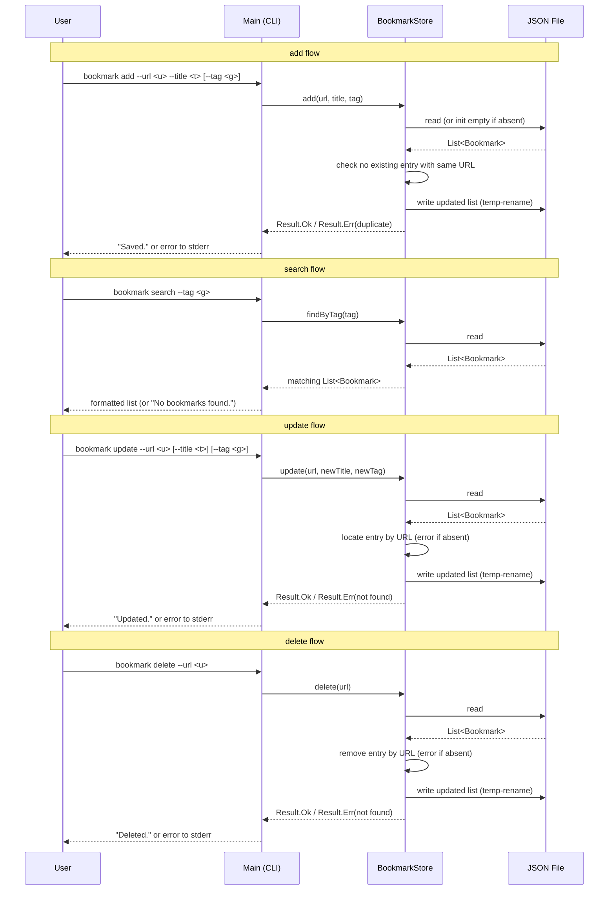

# Implementation Plan: bookmark-manager

> Requirements ref: sdlc/requirements/bookmark-manager.md (status: APPROVED)
> Target repos: `asdlc`
> Generated: 2026-07-04 (updated after open-question resolution)

## Tech Stack

- **Language/stack**: Kotlin / JVM
- **Identified from**: explicit statement in raw request's technical notes (`draft.md`)

## Scaffold Reference

Target workspace was empty. `kotlin-scaffold` has been copied into `asdlc/kotlin-scaffold/`
by the user. Running `./gradlew test` on the scaffold should pass before any feature code
is written.

Reference scaffold: `kotlin-scaffold` (see `references/scaffold_registry.md`).

*Note: this skill copies an existing reference scaffold verbatim when one is available; it
does not author feature source files. Implementing the actual feature is a separate Coding
Agent's job, invoked after this document is approved.*

## Component Design

Three focused components. No external dependencies beyond whatever JSON library the scaffold
already pulls in (Coding Agent to confirm — prefer `kotlinx.serialization` if available,
else `gson`).

**`Bookmark` (data class)**
Fields: `url: String`, `title: String`, `tag: String?`. Serialisable to/from JSON.
`url` is the natural key — uniqueness is enforced by `BookmarkStore`, not at the type level.

**`BookmarkStore`**
Accepts the JSON file path at construction time (user-configurable; default: `~/.bookmarks.json`
or a value read from a `BOOKMARKS_FILE` environment variable — Coding Agent to pick one
consistent approach). Exposes the full CRUD surface:

- `add(url, title, tag?)` — loads file; errors if a bookmark with the same URL already
  exists; appends new entry; writes back atomically (temp file + `Files.move(ATOMIC_MOVE)`)
- `list()` — loads file; returns all entries
- `findByTag(tag)` — loads file; returns entries whose tag equals `tag` (exact-match,
  case-sensitive — no fuzzy or substring matching)
- `update(url, newTitle?, newTag?)` — loads file; errors if URL not found; applies
  non-null fields; writes back atomically
- `delete(url)` — loads file; errors if URL not found; removes entry; writes back atomically

On load: absent file → initialise empty list. Unparseable file → surface a clear error
with the file path; do not silently overwrite.

**`Main` (CLI entry point)**
Parses subcommands via the scaffold's existing argument-parsing approach (or `kotlinx-cli`
if already on the classpath). Subcommands:

| Subcommand | Flags | Notes |
|---|---|---|
| `add` | `--url`, `--title`, `[--tag]` | Errors on duplicate URL |
| `list` | — | Prints all bookmarks |
| `search` | `--tag` | Exact-match filter |
| `update` | `--url`, `[--title]`, `[--tag]` | At least one of `--title`/`--tag` required |
| `delete` | `--url` | Errors if URL not found |

Global flag: `--file <path>` (or env var `BOOKMARKS_FILE`) to override the default JSON
file location.

Stdout: human-readable output. Stderr + non-zero exit: all errors.

## Sequence Diagram

## API Changes

_No API changes — this is a standalone CLI tool with no HTTP interface._

## Database Changes

_No database changes — storage is a local JSON file managed entirely by `BookmarkStore`._

## Security Considerations

- The JSON file is written in plaintext. URLs containing credentials or tokens in query
  parameters (e.g. `?token=...`) will be stored unencrypted. Document this in the tool's
  help text so users are aware before saving sensitive links.
- No shell execution or dynamic evaluation occurs; input touches only the JSON serialiser
  and string comparisons, so injection risk is negligible.
- File permissions on the JSON store are OS defaults for the running user — on shared
  machines, other local users could read it. Out of scope for this low-priority internal
  tool, but noted for future hardening.

---
*This plan is scoped strictly to the linked requirements.md. Anything beyond that scope
should appear as an open question on requirements.md, not silently included here.*
