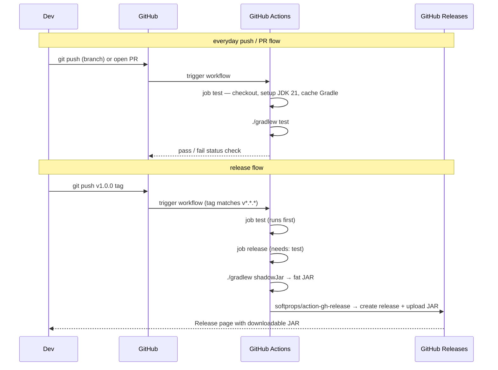

# Implementation Plan: cicd-github-actions

> Requirements ref: sdlc/requirements/cicd-github-actions.md (status: APPROVED)
> Target repos: `asdlc`
> Generated: 2026-07-04

## Tech Stack

- **Language/stack**: GitHub Actions YAML + Gradle Shadow plugin (Kotlin/JVM project)
- **Identified from**: explicit in user request and existing project structure

## Scaffold Reference

Target workspace already has existing code — no scaffold needed. The workflow file is a
new YAML file placed under `.github/workflows/`.

*Note: this skill does not author feature source files. Implementing the actual workflow
and Gradle changes is a separate Coding Agent's job.*

## Component Design

**Two changes to the project:**

### 1. `build.gradle.kts` — add Shadow JAR plugin
Add `id("com.github.johnrengelman.shadow") version "8.1.1"` to the plugins block.
This provides the `shadowJar` task which bundles all runtime dependencies into a single
executable fat JAR. No other `build.gradle.kts` changes required.

### 2. `.github/workflows/ci.yml` — single workflow file, two jobs

**Job: `test`**
Triggers: `push` (all branches) + `pull_request` (all branches).
Steps:
1. `actions/checkout@v4`
2. `actions/setup-java@v4` — distribution `temurin`, java-version `21`
3. `gradle/actions/setup-gradle@v4` — handles Gradle dependency + wrapper caching automatically
4. `chmod +x gradlew` — ensures executable permission on Linux runner
5. `./gradlew test`

**Job: `release`**
Triggers: `push` with tags matching `v*.*.*` only.
Needs: `test` (must pass before release job starts — broken builds never produce a release).
Permissions: `contents: write` (required to create a GitHub Release).
Steps:
1. `actions/checkout@v4`
2. `actions/setup-java@v4` — temurin 21
3. `gradle/actions/setup-gradle@v4`
4. `chmod +x gradlew`
5. `./gradlew shadowJar` — produces `build/libs/kotlin-scaffold-*-all.jar`
6. `softprops/action-gh-release@v2` — creates a GitHub Release for the tag and uploads
   the fat JAR as a release asset. Uses `GITHUB_TOKEN` (built-in, no extra secret needed).

## Sequence Diagram

## API Changes

_No API changes._

## Database Changes

_No database changes._

## Security Considerations

- Uses the built-in `GITHUB_TOKEN` for release creation — no personal access token or
  extra secret required; token is scoped to the repository and expires after the run.
- `contents: write` permission is declared explicitly on the `release` job only, not
  the entire workflow, limiting blast radius.
- The `test` job runs on PRs from forks — fork PRs get a read-only token by default,
  which is correct since they only read code and run tests.
- Never log build outputs that might contain file paths with credentials (e.g. from env
  vars in test output) — Gradle's default output is safe here.

---
*This plan is scoped strictly to the linked requirements.md. Anything beyond that scope
should appear as an open question on requirements.md, not silently included here.*
